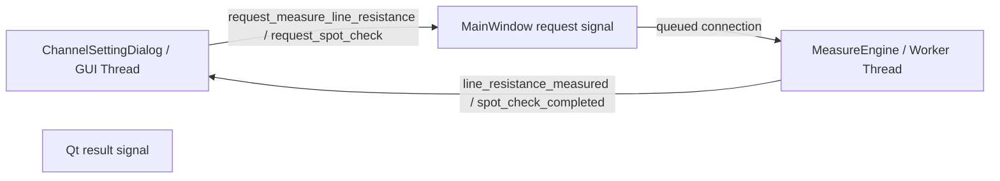
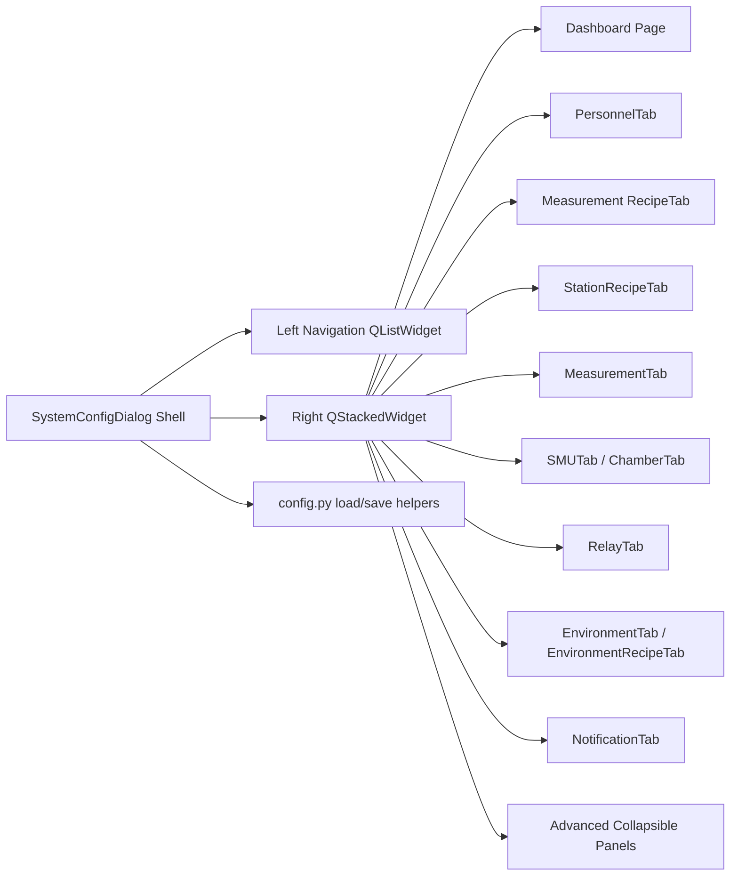

# Architecture Overview (v8)

此文件描述 ReliabilityX Pro 目前程式碼的實際軟體架構、執行緒邊界、設定檔責任與已規劃但尚未完全接入的重構方向。

**v8 重點**：本版修正 v7 與程式碼之間的落差。特別是 `MeasureEngine Phase 1` 拆分、`ChannelSettingDialog` 診斷呼叫、Telegram PDF 趨勢報告、JSON 設定檔清單等內容，均改為明確區分「目前實作」與「目標架構」。

---

## Runtime Startup Dependency Gate

`main.py` now executes `dependency_bootstrap.ensure_runtime_dependencies()` before importing PyQt6, instrument drivers, `config`, or GUI modules.  This startup gate belongs to deployment/runtime preparation, not to the measurement model layer: it uses only Python standard-library modules, writes diagnostics to `logs/dependency_bootstrap.log`, and exits before creating `QApplication` if the Python environment cannot be prepared.

This preserves the MVC boundary because no scientific calculations or hardware actions occur during dependency installation.  In PyInstaller-frozen mode the gate is skipped, since the required packages must already be bundled by the build process.

## 1. 分層架構 (Layered Architecture)

ReliabilityX Pro 採用四層式架構，但目前核心量測流程仍以 `MeasureEngine` 為主 façade。`core/hardware/*` 與 `core/diagnostics/*` 已建立 service scaffold，但目前尚未正式接入 `MeasureEngine`。

```mermaid
graph TD
    subgraph Physical Hardware
        D[Physical Instruments<br/>(SMU, Relay, Chamber, Glovebox)]
    end

    subgraph Hardware Abstraction Layer
        C[Drivers<br/>(driver/smu_driver.py, chamber_driver.py, ...)<br/>封裝 VISA / Serial / RS-485 / vendor protocol]
    end

    subgraph Business Logic Layer - Current Runtime
        B[MeasureEngine<br/>(core/measure_engine.py)<br/>目前實際掃描、硬體狀態、Relay path、line-R、spot check 入口]
        E[EnvironmentManager<br/>(core/environment_manager.py)<br/>管理 environment profiles 與 ISOS recipes]
        N[NotificationManager<br/>(core/notification_manager.py)<br/>Telegram text / PNG trend / schedule / error alert]
        S[Trend Scope Helpers<br/>(core/trend_scope_utils.py, core/trend_spec.py)]
    end

    subgraph Business Logic Layer - Scaffold / Target Refactor
        H[HardwareManager<br/>(core/hardware/hardware_manager.py)<br/>已存在，但尚未由 MeasureEngine 正式使用]
        R[RelayPathService<br/>(core/hardware/relay_path_service.py)<br/>已存在，但尚未由 MeasureEngine 正式使用]
        X[DiagnosticsService<br/>(core/diagnostics/diagnostics_service.py)<br/>已存在，但尚未由 MeasureEngine 正式使用]
    end

    subgraph Presentation Layer
        A[MainWindow / Dialogs / Widgets<br/>(gui/main_window.py, gui/channel_setting_dialog.py, gui/config_tabs/*, gui/widgets/*)]
        T[TrendSnapshotRenderer<br/>(gui/trend_snapshot_renderer.py)<br/>PNG snapshot 與 PDF renderer]
    end

    A -- queued signals: init/start/stop/reload --> B
    B -- Qt signals: status/points/results/finish --> A
    B -- driver calls --> C
    C -- hardware commands --> D
    D -- raw responses --> C
    C -- parsed responses --> B

    A -- create/use --> E
    A -- create/use --> N
    A -- create/pass renderer --> T
    N -- receives engine results --> B
    N -- uses renderer object --> T
    N -- uses trend helpers --> S

    H -. target replacement for hardware probe/reconnect .-> B
    R -. target replacement for relay path setup/cleanup .-> B
    X -. target replacement for diagnostics .-> B
```

### 1.1 依賴方向規則 (Dependency Direction Rule)

> 高層可以依賴低層；低層不得反向依賴高層 UI。

- ✅ `gui/` 可以 import `core/`。
- ✅ `core/` 可以 import `driver/`、`config.py` 與標準函式庫。
- ✅ `core/notification_manager.py` 可接收外部傳入的 renderer 物件，但不應直接 import GUI widget。
- ❌ `driver/` 不應 import `core/` 或 `gui/`。
- ❌ `core/` 不應直接 import `gui/` 中的視窗或 widget。

若低層需要通知高層，必須透過 Qt signal、callback 或明確注入的 interface 物件，而不是直接呼叫 UI。

---

## 2. 執行緒模型 (Threading Model)

### 2.1 目前已實作的 worker-thread 邊界

`MainWindow` 建立一個 `QThread`，並將 `MeasureEngine` 移入該 worker thread：

- `request_init_hardware` → `MeasureEngine.initialize_hardware`
- `request_start_scan` → `MeasureEngine.start_scan_cycle`
- `request_stop_scan` → `MeasureEngine.stop_scan_cycle`
- `request_reload_config` → `MeasureEngine.reload_config`，若該 method 存在

上述 request signal 使用 `Qt.ConnectionType.QueuedConnection`，因此正式的硬體初始化、掃描啟動、停止請求與設定重載會排入 worker thread 執行。

`MeasureEngine` 透過以下 Qt signals 回傳狀態與資料：

- `hardware_status_updated`
- `env_data_updated`
- `scan_started`
- `scan_finished`
- `channel_status_updated`
- `channel_scan_pre_start`
- `channel_scan_prepared`
- `point_measured`
- `channel_measurement_finished`

### 2.2 目前需要修正的 thread-boundary 缺口

目前 `ChannelSettingDialog` 仍直接呼叫 `MeasureEngine` 的診斷方法：

```python
self.engine.measure_line_resistance(pos_pin, neg_pin)
self.engine.perform_spot_check(self.ch_id, pos_pin, neg_pin)
```

這代表 **line resistance** 與 **spot check** 的診斷流程目前不是透過 request signal 安全排入 worker thread。因為 `MeasureEngine` 已被 `moveToThread()`，從 GUI thread 直接呼叫其 method 容易造成 thread affinity 誤用，也可能讓耗時硬體操作阻塞 UI。

v8 因此不再宣稱 `ChannelSettingDialog` 已完成 signal-based diagnostics。正確的目標架構應是：



在完成這項重構前，所有文件與後續修改都應把診斷功能視為「目前仍有 thread-boundary 技術債」。

### 2.3 NotificationManager 的執行緒

`NotificationManager` 由 `MainWindow` 建立，通常位於 GUI thread：

- 使用 `QTimer` 每 20 秒檢查定時摘要條件。
- Telegram HTTP 發送使用 daemon `threading.Thread`，避免阻塞 UI。
- 趨勢圖 PNG 產生目前在 schedule dispatch 流程中同步呼叫 renderer，之後才啟動 Telegram 發送 thread。

---

## 3. 量測主流程 (Measurement Runtime Flow)

目前主量測流程由 `MeasureEngine.start_scan_cycle(active_channels_data)` 管理：

1. 檢查是否已在執行中。
2. 重置 scan state。
3. 檢查 SMU / Relay 是否 ready，並載入 `channel_settings.json`、`calibration_settings.json`、`hardware_map.json`。
4. 發出 `scan_started`。
5. 逐一量測 active channels。
6. 每個 channel 內部建立 relay path、執行 forward/reverse scan、計算 IV 參數、記錄 summary/curve data。
7. 發出 point/result/status signals 給 IV monitor、trend chart、channel cards 與 notification manager。
8. 掃描完成、停止或失敗後，關閉 SMU output、reset relay，發出 `scan_finished(finish_info)`。


### 3.2 Global scheduler controls

The main window distinguishes two control levels:

- Per-channel checkbox: controls whether one logical channel is included in cyclic measurement (`開始循環量測` / `暫停循環量測`).
- Left-side global buttons: control the whole scheduler (`▶ 啟動全部循環量測` / `⏸ 停止全部循環量測`).

`MainWindow.on_start_clicked()` validates checked channel cards, confirms the global start request, then emits `request_start_scan(active_channels_data)`. `MainWindow.on_stop_clicked()` confirms the global stop request, updates the global status label to safe-stopping, then emits `request_stop_scan()`.

The control panel status label is updated from scan lifecycle and current-channel signals:

- `scan_started` → `量測排程執行中`
- `channel_scan_pre_start(ch_id)` → `量測中 — CH_x## / Device`
- `channel_measurement_finished` → `量測排程執行中，等待下一個 Channel`
- `scan_finished(finish_info)` → stopped, completed, no-active-channel, or error-stopped state based on `finish_reason`

### 3.1 Graceful stop 行為

目前停止流程是 **完成目前元件正逆掃後停止**，不是立即中斷：

- UI 端由 `MainWindow.on_stop_clicked()` 進行全域停止確認，並更新左側控制面板狀態列為「安全停止中」。
- `request_stop_scan` 排入 worker thread。
- `MeasureEngine.stop_scan_cycle()` 設定 `stop_requested=True`。
- `start_scan_cycle()` 在 channel 邊界檢查 stop flag，不再進入下一顆元件。
- `scan_finished` 的 `finish_info` 可標示 `finish_reason="stopped_after_current_channel"`。

---

## 4. 環境子系統 (Environment Subsystem)

目前環境設定主要由 `EnvironmentManager` 與 GUI tabs 管理：

- `core/environment_manager.py`
  - 管理 environment instance/profile。
  - 管理 environment control recipes。
  - 預設讀寫：
    - `config/environment_profiles.json`
    - `config/environment_control_recipes.json`
- `gui/config_tabs/environment_tab/environment_tab_main.py`
  - 建立共享 `EnvironmentManager`。
  - 組合 climate chamber、vacuum glovebox、indoor environment 等子 tab。
- `gui/config_tabs/environment_tab/*`
  - 各 environment type 的管理介面。
  - 部分 widget 已拆成 connection/status/control/recipe/relay assignment 等小型元件。
- `gui/channel_setting_dialog.py`
  - 建立自己的 `EnvironmentManager()` 以讀取可選 environment 與 recipe 綁定資訊。

### 4.1 目前限制

`MeasureEngine` 目前仍只持有 `chamber_driver` 作為硬體連線狀態的一部分，並未完整接入 `EnvironmentManager` 的 recipe runtime control。換句話說，環境子系統目前主要是設定管理與 GUI 結構，還不是完整的 closed-loop environment runtime engine。

---

## 5. 通知子系統 (Notification Subsystem)

### 5.1 目前已實作功能

`NotificationManager` 目前負責：

- Telegram 開始量測通知。
- Telegram 完成/停止通知。
- logger error record 觸發重大錯誤通知。
- 定時摘要。
- 趨勢圖 PNG 產生與發送。
- 量測結果歷史 `trend_history` 暫存。

`MainWindow` 建立 `TrendSnapshotRenderer`，再把 renderer 注入 `NotificationManager`：

```python
self.trend_snapshot_renderer = TrendSnapshotRenderer(getattr(self.engine, "log_mgr", None))
self.notification_manager = NotificationManager(
    self.engine,
    getattr(self.engine, "log_mgr", None),
    trend_renderer=self.trend_snapshot_renderer,
    parent=self,
)
```

### 5.2 目前 PNG dispatch 行為

目前 `NotificationManager._on_schedule_timer()` 的流程是：

1. 檢查 Telegram 是否啟用。
2. 檢查是否啟用定時摘要。
3. 只在設定的小時、且 `now.minute == 0` 時觸發。
4. 若 `trend_images_enabled=True` 且有 renderer，呼叫 `_dispatch_trend_images()`。
5. `_dispatch_trend_images()` 會依每個 metric 產生一張 PNG，再送 Telegram image/document。
6. 若沒有趨勢圖可送，才退回文字摘要。

### 5.3 PDF 趨勢報告狀態

目前程式碼中已存在：

- `config.notification_settings.json` 支援：
  - `trend_pdf_enabled`
  - `trend_pdf_include_env_when_available`
- `gui/config_tabs/notification_tab.py` 已有 PDF checkbox 與說明。
- `gui/trend_snapshot_renderer.py` 已實作 `render_pdf_report()`。

但目前 `NotificationManager` 的 schedule dispatch 尚未接上 PDF 流程；實際定時通知仍走 `_dispatch_trend_images()` 的 PNG-per-metric 流程。

因此 v8 的文件結論是：

> PDF renderer 與設定欄位已存在，但 Telegram 定時通知尚未完整改為 active-scope PDF dispatch。

後續若要完成 ADR-0024 所描述的目標，應新增或接上類似以下責任：

- 依 `trend_pdf_enabled` 判斷 PDF 或 PNG dispatch。
- 依 `trend_group_mode` 進行 `overall` / `user_project` 分組。
- 使用 `pending_scan_channels` 或 active scope entries 篩選目前正在量測中的 device series。
- 呼叫 `TrendSnapshotRenderer.render_pdf_report()`。
- 以 Telegram `sendDocument` 發送 PDF。

---

## 6. Trend Monitor 與 Snapshot Renderer

### 6.1 Trend Chart runtime

`gui/trend_chart_window.py` 負責互動式 trend monitor：

- 接收 `channel_measurement_finished` result。
- 管理 active scope。
- 依使用者 / 專案 / device / channel 組合建立 series key。
- 與 `core/trend_scope_utils.py` 共用 scope/group helper。

### 6.2 Snapshot renderer

`gui/trend_snapshot_renderer.py` 負責輸出：

- 單張高解析度 PNG snapshot。
- 多頁 PDF trend report。
- 可在有 environment data 時加入環境子圖。

目前 renderer 放在 `gui/` 目錄，但它的角色比較接近 presentation output adapter，而非互動式 GUI widget。`NotificationManager` 透過依賴注入使用它，避免 `core/notification_manager.py` 直接 import GUI module。

---

## 7. 設定管理 (Configuration Management)

`config.py` 是大部分 JSON 設定檔的集中入口，但仍有少數設定由特定 manager 或 widget 直接指定路徑。

### 7.1 JSON 設定檔清單

| 檔案 | 目前主要使用者 | 用途 |
| :--- | :--- | :--- |
| `config_settings.json` | `config.py`, system config | 硬體介面、全域安全限制等設定。 |
| `user_settings.json` | `config.py` | 本機 data/log 儲存路徑。 |
| `channel_settings.json` | `MainWindow`, `ChannelSettingDialog`, `MeasureEngine` | 32 通道量測參數、user/project/device、relay pin、environment binding、啟用狀態。 |
| `calibration_settings.json` | `CalibrationDialog`, `ChannelSettingDialog`, `MeasureEngine`, `IVMonitorWindow` | 線阻校正、line resistance map 與校正資料。 |
| `hardware_map.json` | `config.py`, `MeasureEngine` | 邏輯通道 CH1-32 到 relay 實體 pin 的映射。 |
| `personnel_tab.json` | `PersonnelTab`, `ChannelInfoWidget`, `config.py` | User / Project 對應表。 |
| `notification_settings.json` | `NotificationTab`, `NotificationManager`, `config.py` | Telegram token/chat id、通知事件、每日時段、trend PNG/PDF 偏好。 |
| `measurement_recipes.json` | `MeasurementTab`, `ChannelSettingDialog`, `config.py` | 量測 recipe library，供 channel 快速套用。 |
| `environment_profiles.json` | `EnvironmentManager` | Environment instances，例如特定 chamber、glovebox、indoor profile。 |
| `environment_control_recipes.json` | `EnvironmentManager` | Environment control recipes，對應 ISOS 條件或使用者自訂環境控制參數。 |
| `iv_plot_settings.json` | `IVPlotWidget`, `IVPlotSettingsDialog` | IV plot 顯示設定，例如字型、線條、grid、legend、axis label。 |
| `trend_plot_settings.json` | `TrendPlotWidget`, `TrendPlotSettingsDialog` | Trend plot 顯示設定，例如字型、線條、grid、legend、environment subplot。 |

### 7.2 設定檔原則

- 新增 runtime 設定檔時，應優先經由 `config.py` 建立常數與 load/save helper。
- 若由特定 manager 直接持有路徑，例如 `EnvironmentManager`，應在本文件與相關 ADR 中明確列出。
- GUI 不應私自產生同名但格式不同的 JSON。
- 對既有設定檔格式做 migration 時，必須保留舊欄位相容讀取。
- Public repository 只追蹤安全的 `*.example.json` schema 與正式 immutable defaults；包含人員、專案、device、實機位址、校正值、通知秘密或 runtime state 的 live JSON 必須維持 local-only。

---

## 8. Root-Level Build & Release Toolchain

根目錄建置工具目前包含：

- `compile_ui.py`
  - 將 `gui/ui/*.ui` 編譯為 `*_ui.py`。
- `build_and_deploy.py`
  - 呼叫 PyInstaller 進行 onedir 打包。
  - 建立部署 ZIP。
  - 應保留互動式路徑詢問與是否打包 config 設定檔的選項。
  - 應依需求檔與 spec 設定納入必要 third-party packages，例如 PyQt6、pyqtgraph、reportlab 等。

打包邏輯應避免把開發備份資料夾、`__pycache__`、logs、舊版 backup stage 等不必要內容混入最終交付 ZIP。

---

## 9. MeasureEngine Phase 1 拆分狀態

### 9.1 目前真實狀態

| 項目 | 檔案 | 狀態 |
| :--- | :--- | :--- |
| `HardwareManager` | `core/hardware/hardware_manager.py` | 類別已存在，封裝 probe/reconnect/shutdown，但 `MeasureEngine` 目前未使用。 |
| `RelayPathService` | `core/hardware/relay_path_service.py` | 類別已存在，封裝 reset/prepare/cleanup relay path，但 `MeasureEngine` 目前未使用。 |
| `DiagnosticsService` | `core/diagnostics/diagnostics_service.py` | 類別已存在，封裝 line-R 與 spot check，但 `MeasureEngine` 目前未使用。 |
| `MeasureEngine` | `core/measure_engine.py` | 仍直接實作硬體 probe、reconnect、relay reset/path、line resistance、spot check、scan lifecycle。 |

因此目前不能把 Phase 1 描述成「已完成拆分」。準確說法應是：

> Phase 1 service scaffold 已建立，但 production runtime 尚未切換到 service-based implementation。

### 9.2 目標拆分責任

後續若要完成 Phase 1，建議責任如下：

- **保留於 `MeasureEngine`**
  - Qt signal 對外 API。
  - scan lifecycle 與 stop state。
  - 單通道量測主流程 orchestration。
  - 與 logger / summary logger / IV curve logger 的整合。

- **移至 `HardwareManager`**
  - SMU / Relay / Chamber probe。
  - 僅重連未連線設備。
  - 安全關閉硬體。
  - measurement-ready 檢查。

- **移至 `RelayPathService`**
  - `reset_all()`。
  - channel measurement path setup。
  - diagnostics path setup。
  - path cleanup。

- **移至 `DiagnosticsService`**
  - line resistance measurement。
  - spot check。
  - 診斷流程中的 SMU source/output/readback。

### 9.3 完成拆分時的必要條件

完成重構時至少應滿足：

1. `MeasureEngine.__init__()` 建立或接收 `HardwareManager`、`RelayPathService`、`DiagnosticsService`。
2. `MeasureEngine` 的 probe/reconnect/path/diagnostics method 不再重複保留完整邏輯。
3. `ChannelSettingDialog` 不直接呼叫 worker object method，而是透過 queued request signal。
4. 新增 result signals，例如：
   - `line_resistance_measured`
   - `line_resistance_failed`
   - `spot_check_completed`
   - `spot_check_failed`
5. 舊的 GUI 行為、按鈕狀態、錯誤訊息與 calibration JSON 寫入仍保持相容。

---

## 10. 已知架構缺口與後續優先順序

### Canonical open item tracker

本節保留高層級架構缺口摘要；正式、可追蹤的 backlog 與技術債狀態以 `docs/OPEN_ITEMS.md` 為準。若本節與 `OPEN_ITEMS.md` 不一致，應立即同步更新，避免 open item 分散在多個文件中。


### 高優先順序

1. **修正 ChannelSettingDialog 診斷 thread boundary**
   - 目前直接呼叫 worker object method。
   - 應改為 request/result signal。

2. **決定 Phase 1 service scaffold 的命運**
   - 要嘛正式接入 `MeasureEngine`。
   - 要嘛在文件中持續標記為未接入，避免誤導。

3. **完成 Telegram PDF dispatch**
   - `TrendSnapshotRenderer.render_pdf_report()` 已存在。
   - `NotificationManager` 尚未依 `trend_pdf_enabled` 切換 PDF 流程。

### 中優先順序

4. **整理 EnvironmentManager runtime responsibility**
   - 目前偏設定管理。
   - 若要支援真正 ISOS runtime control，需定義 engine 與 chamber/glovebox driver 的控制邊界。

5. **統一 JSON 設定檔入口**
   - 將 plot settings 與 environment paths 是否集中到 `config.py` 需做一致性決策。

6. **Build artifact 過濾規則**
   - 打包 ZIP 應排除 backup folders、logs、`__pycache__` 與暫存檔。

---

## 11. 文件維護規則

1. 若程式碼與本文件不一致，以實際程式碼為準，並立刻更新本文件。
2. 每次新增 core service、thread signal、JSON setting 或 build artifact 規則時，應同步更新本文件與 `docs/OPEN_ITEMS.md`。
3. 若 ADR 描述的是目標設計但程式碼尚未實作，本文件必須標示為 **Target / Not Yet Wired**。
4. 不得把 scaffold class 寫成 production runtime，除非主流程已實際 import 並使用。
5. 對使用者可見的功能，例如 Telegram PDF、environment runtime control、diagnostics thread safety，必須用目前程式實作狀態描述，不可只描述預期功能。
6. 若架構缺口形成可執行工作項，必須在 `docs/OPEN_ITEMS.md` 建立或更新對應 OI 編號。

---

## 12. Dynamic Logical Channel Mode (ADR-0038)

### 12.1 Runtime concept

The main window no longer treats CH01-CH32 as fixed visible UI cards. Instead, `MainWindow` rebuilds the displayed card grid from configured entries in `config/channel_settings.json`.

The persisted data model now distinguishes:

- **Internal numeric channel id**: existing integer `ch_id`, retained for logger/signal/file compatibility.
- **Logical channel label**: user-facing label such as `CH_C01`, `CH_I01`, or `CH_V01`.
- **Relay path**: selected `relay_pos` / `relay_neg` physical relay pins.
- **Environment instance**: selected environment profile used to limit legal relay dropdown ranges.

### 12.2 Relay selection and sharing

`ChannelSettingDialog` keeps direct SMU+ / SMU− relay selection. It does not require users to define a shared-bus topology in this implementation.

The controller derives relay usage from `channel_settings.json`:

1. Relay not used by other channels with the same polarity:
   - UI shows `Relay XX 為獨立 relay。`
2. Relay used by another channel with the same polarity:
   - UI shows `Relay XX 將與 Device A 共用正極/負極。`
   - Saving asks for confirmation.
3. Relay used by another channel with the opposite polarity:
   - UI blocks saving as a polarity conflict.
4. Same channel selects the same relay for SMU+ and SMU−:
   - UI blocks saving as a short-circuit risk.

### 12.3 Environment-limited relay ranges

After the user selects an environment instance, `ChannelSettingDialog` obtains the legal SMU+ and SMU− relay ranges from `EnvironmentManager.get_relay_range()` and updates the relay dropdowns. The dialog validates the range again before saving to prevent cross-environment relay selection.

### 12.4 Measurement scheduler

`MeasureEngine.start_scan_cycle()` delegates due-time ordering to `core/measurement_scheduler.py`. The engine remains the Qt-facing measurement orchestration facade, while the scheduler owns per-channel cadence and conflict metadata. Each runtime schedule record contains:

- channel settings payload
- `next_due`
- `interval_min`
- active flag
- planned vs actual timing metadata
- conflict / queue metadata

The engine measures due channels one at a time because the system has one SMU/relay resource. If multiple channels are due at the same time, they are queued deterministically by scheduled due time, priority, interval, and creation order. The conflict is written to the system log and the measurement metadata.

After a channel finishes:

- if `interval_min > 0`, its `next_due` is updated from the served scheduled due time, not from actual finish time: `next_due = scheduled_due + interval_min`.
- if `interval_min <= 0`, it behaves as a one-shot channel and is removed from the active schedule.

This means queue delay does not cause cadence drift. Example: if Device A is measured every 10 min and Device B every 15 min, and both are due at 09:00, Device B can be measured after Device A, but the next due times remain 09:10 for Device A and 09:15 for Device B.

The engine still measures only one channel path at a time and retains the ADR-0018 relay safety rule: reset all relays before opening the target channel relay path and reset again after measurement.


## 13. Environment-grouped Channel Cards and End Channel Flow (ADR-0039)

### 13.1 Canonical environment inference

Dynamic channel display and detail editing now share the same environment inference priority:

1. valid saved `environment_instance`
2. persisted logical label prefix (`CH_C`, `CH_I`, `CH_V`)
3. environment relay ranges from `EnvironmentManager`
4. current dropdown fallback only when no legacy evidence exists

This prevents a legacy channel from showing as `CH_C##` on the card while opening the detail dialog with an unrelated default environment.

### 13.2 Main-window grouping

`MainWindow.load_and_refresh_all_channels()` rebuilds the dynamic channel area as environment group boxes. Vacuum / Glovebox (`CH_V##`), Indoor (`CH_I##`), and Climate Chamber (`CH_C##`) channels are visually separated instead of being mixed in one flat row.

### 13.3 End experiment / remove active channel

Each `ChannelCard` exposes an end-channel request. `MainWindow.on_end_channel_requested()` confirms the user intent, archives the final channel settings to `config/archived_channel_settings.json`, removes the active entry from `config/channel_settings.json`, refreshes the dynamic card list, and logs the relay path release. This action does not delete scientific data files. It is blocked while measurement is running; users must stop the scan and wait for the current channel boundary before removal.


## 2026-05-14 Update: Cycle Measurement Toggle and Logical Label De-duplication

- Channel cards now treat the checkbox as an explicit scheduling control: checked means `開始循環量測`, unchecked means `暫停循環量測`.
- `MainWindow.on_channel_toggled()` confirms the operator action before writing `is_enabled` to `channel_settings.json`. Cancelled changes are reverted in the card UI.
- `ChannelInfoWidget` uses the same cyclic-measurement wording and confirms user-driven toggles inside the channel settings dialog.
- Dynamic channel list filtering now requires a complete `relay_pos` / `relay_neg` path, preventing draft or legacy fixed-channel records from appearing as active logical channels.
- Logical label display and generation reserve explicit labels and valid legacy-derived labels to prevent duplicated `CH_V##`, `CH_I##`, or `CH_C##` names.

## 2026-05-14 Update: Canonical Open Items Tracker (ADR-0041)

`docs/OPEN_ITEMS.md` is now the canonical backlog for current open items and technical debt. It consolidates previously scattered future-work notes from `ToDo list.txt`, architecture gaps, codebase notes, and patch discussions.

Key rules:

- `ARCHITECTURE.md` keeps structural explanations and high-level known gaps.
- `CODEBASE_MAP.md` keeps actual module responsibilities and runtime wiring status.
- `OPEN_ITEMS.md` keeps actionable backlog entries, priorities, status, evidence, next actions, and acceptance criteria.
- `version_history.txt` records completed changes.
- `CHANGESET_MANIFEST.md` is not used as a durable tracker unless the user explicitly requests it.


## 2026-05-15 Runtime Hardening Update

- Telegram secrets are release-isolated. `notification_settings.json` may store only `bot_token_file` and `chat_id_file` paths; real TXT secret files should remain outside distributed ZIP packages. Runtime notification code resolves those files immediately before sending.
- Corrected IV data now applies current offset before line-resistance compensation: `i_corr = i_msd - offset_current`, then `v_corr = v_msd - i_corr * R_line`.
- Channel diagnostics are requested through queued Qt signals and executed in the `MeasureEngine` worker thread. GUI dialogs receive result dictionaries through engine result signals.
- `MeasurementScheduler` persists runtime schedule state to `config/runtime_schedule_state.json`, preserving `next_due` across restarts while keeping the cadence anchored to `scheduled_due + interval`.
- `MeasureEngine` logs scheduler overload warnings when estimated active-channel measurement load exceeds the shortest configured interval.


## Shutdown Architecture Update — 2026-05-15

主畫面的「🛑 安全關閉程式」由 `core/shutdown_manager.py` 統一管理，不再由 `MainWindow.closeEvent()` 直接關閉硬體。使用者按下按鈕或 OS 視窗關閉時，系統會先彈出三選一確認：

1. `✅ 安全流程關閉`：停止 scheduler，不再派發新量測；等待目前 channel 到達既有 graceful stop boundary；強制 `SMU output OFF -> Relay reset_all`；關閉硬體連線；停止 notification manager；關閉 worker thread；離開程式。
2. `⚠️ 緊急停止並關閉`：立即要求 abort，設定 `emergency_shutdown_and_exit`，強制 `SMU output OFF -> Relay reset_all`，關閉硬體連線並記錄 critical shutdown log；目前量測點可能不完整。
3. `取消`：不改變量測或硬體狀態。

`MeasureEngine` 提供 `force_safe_hardware_state(close_connections=False)` 與 `emergency_shutdown()` 作為 shutdown primitive。`MainWindow` 僅負責呼叫 `ShutdownManager`，避免 GUI controller 繼續肥大。

---

## 9. SystemConfigDialog Shell (OI-045, ADR-0050)

`gui/system_config_dialog.py` is now a shell/controller rather than a top-level collection of same-level tabs.  The dialog builds a left-side navigation list and a right-side `QStackedWidget` content area.  Existing config tab widgets are embedded as content pages so this phase improves the information architecture without rewriting all legacy tabs at once.



### 9.1 Recipe provenance split

- `Measurement Recipe` describes **how to measure**: IV voltage range, step size, delay, interval, compliance current, and cell area.
- `Station Recipe` describes **where / with which station to measure**: SMU settings, Relay settings, Chamber settings, environment profile, calibration profile, and notification profile.

This separation prevents hardware/environment provenance from being mixed with IV scan conditions in the same recipe list.  The new station recipe library is stored in `config/station_recipes.json` and accessed through `config.load_station_recipes()` / `config.save_station_recipes()`.

### 9.2 Phase boundary

OI-045 only changes the config dialog shell and station recipe editing/persistence.  Station recipes are not yet applied to runtime hardware initialization or report metadata.  That runtime integration should be added as a later open item after the UI shell is validated.

---

## 2026-05-17 Update — Active-scope System Config, Unified Environment/Station Recipes, and R-line Diagnostics

### Design goal

System Config now treats the active channel cards as the source of task readiness. The GUI must not report unused hardware or unused environments as blocking errors. For example, if no active channel uses a vacuum environment, a disconnected vacuum controller is displayed as unused information rather than a measurement blocker.

### Updated data flow

```text
channel_settings.json
  -> config.get_active_channel_records()
  -> DashboardPage / ChannelOverviewPage / RLineDiagnosticsTab / RelayTab

calibration_settings.json
  -> config.evaluate_active_rline_readiness()
  -> active-pair R-line status and R-line diagnostics

environment_profiles.json
  -> config.build_environment_relay_summary()
  -> Relay / Channel Mapping 3x2 SMU+/SMU- occupancy summary
  -> Dashboard relay availability summary

station_recipes.json
  -> Environment / Station Recipes editor
  -> synced compatibility copy in environment_control_recipes.json
```

### GUI responsibilities

- `DashboardPage` shows only task-scoped readiness derived from active channel cards.
- `ChannelOverviewPage` presents a read-only card/table view of active and configured logical channels.
- `RecipeTab` manages IV measurement recipes and built-in PSC recipe templates.
- `StationRecipeTab` now edits unified Environment / Station recipes. New recipe records describe setpoints, required station hardware, timeline actions, safety limits, notification profile, and calibration profile.
- `RelayTab` owns relay connection UX, environment relay range editing, relay occupancy summaries, and environment-filtered relay matrix display.
- `RLineDiagnosticsTab` owns active-pair readiness and environment-filtered 3D R-line diagnostics.

### Persistence rules

- `channel_settings.json` remains the authoritative active channel assignment source.
- `environment_profiles.json` is the authoritative environment relay range source.
- `station_recipes.json` is the authoritative Environment / Station recipe source.
- `environment_control_recipes.json` is maintained for compatibility with existing environment-control infrastructure.
- New Station/Environment recipes must not store SMU VISA address, Relay COM port, or Chamber serial connection settings as first-class recipe fields. Legacy records are migrated under `legacy_hardware_profile`.

### Readiness policy

A condition is blocking only when all of the following are true:

1. At least one enabled channel requires the resource.
2. The required channel/environment/relay/R-line state is missing, conflicting, expired under the selected policy, or invalid.
3. The issue affects the current task scope.

Unused equipment is not blocking.


### 2026-06-02 Chamber telemetry readiness update

The chamber path now distinguishes serial-open from scientific readiness. `driver.chamber_driver.ChamberDriver` owns RS-485 ASCII framing, FCS diagnostics, Signal `01` parsing, and exposes `test_telemetry()` plus `send_manual_command_detailed()`. `MeasureEngine.poll_chamber_once()` runs in the worker thread and emits `env_data_updated(temp_pv, hum_pv)` only after parsed telemetry. The main window starts a 5 s timer that queues chamber polling to the engine thread.


### Chamber Signal 01 FCS and Analog Parser Update (2026-06-02)

Field diagnostics confirmed that the chamber replies to XOR8 FCS calculated over the frame including the leading `@`. `ChamberDriver` now defaults to `xor8_include_at`, keeps other FCS modes only for diagnostics, and parses Signal `01` analog telemetry as fixed-width 4-character hexadecimal words. Example response `@01010A9127100A917FFF...72*` is decoded as Temp PV 27.05 °C, RH PV 100.00%, Temp SV 27.05 °C, and RH SV unavailable. This preserves the existing GUI/controller boundary: the driver performs protocol/FCS/parsing; GUI widgets only render values or `--.-` for unavailable SV fields.

### 2026-06-03 Detailed error logging standard

All hardware communication and persistence boundaries must separate user-facing error dialogs from persistent diagnostic logs.  UI dialogs may remain concise, but the log path must be sufficient for post-run diagnosis: operation name, hardware identity and parameters, command payload, TX/RX ASCII, TX/RX HEX, FCS or checksum result, parsed fields, exception traceback, and safety action must be recorded when available.

For chamber control, `driver/chamber_driver.py` owns RS-485 command construction and detailed transaction logging.  `gui/config_tabs/chamber_tab.py` only reports a concise failure summary to the operator and points to logs.  A failed setpoint write must not be assumed to have changed the chamber state unless a valid write echo and readback confirmation are obtained.
