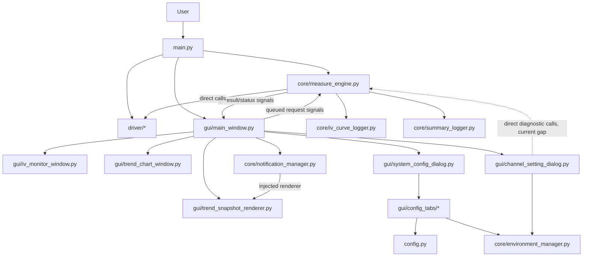

# Codebase Map (v8)

## 2026-09-21: diagnostic explanations (ADR-0063)

- `core/diagnostic_messages.py`: stable validation codes, Chinese cause/actions,
  stage and evidence-based safety summaries, JSON-compatible technical details.
- `gui/diagnostic_dialog.py`: plain-text QMessageBox, Chinese expandable details,
  copy action; no hardware IO.
- `driver/smu_driver.py`: documented GSM CURR?/VOLT? amplitude queries and typed
  transport evidence; actual VISA backend label.
- `core/measure_engine.py` / channel dialog: queued stages and finalized reports.
- `gui/config_tabs/{smu,relay,chamber}_tab.py`: shared failure explanations and
  truthful read/reset/open failure handling without new hardware probes.
- `tests/integration/test_gsm_firmware_diagnostics.py`: strict memory-only firmware
  regression; `tests/unit/test_operator_diagnostics.py`: UI/report evidence tests.

## 2026-09-21: active safety changes (ADR-0062)

- `core/IV_parameter_analysis_utils.py`: R-line qualification, solar polarity,
  signed IV correction, bounded voltage point generation and measured Raw analysis.
- `driver/smu_driver.py`: strict source/output/readback methods and both compliance
  queries; `driver/relay_driver.py`: error-free frames, complete mask verification.
- `config.py`: preserve but disqualify legacy R-line; validate v2 raw evidence.
- `core/measure_engine.py`: cleanup-gated R-line, shared spot/formal polarity,
  mandatory preflight and verified scans; all GUI hardware requests remain queued.
- `gui/channel_setting_dialog.py`: qualified save and blocked legacy display;
  `gui/system_config_dialog.py`: pre-write validation boundary.
- `core/iv_curve_logger.py`, `gui/widgets/iv_plot_widget.py`: measured Raw voltage;
  curve metadata records polarity and calibration version.
- `core/diagnostics/diagnostics_service.py`: inactive scaffold; legacy R-line method
  now raises before IO instead of bypassing qualification.
- New `tests/*/test_qualified*` and `test_diagnostic_gui_guards.py`: offline fault
  injection. `docs/MEASUREMENT_FLOW.md`: source-of-truth operator sequence.

此文件記錄 ReliabilityX Pro 目前程式碼中主要 `.py` 檔案的功能、責任、對外 API、呼叫關係與實作狀態。

**v8 重點**：本版對齊 `ARCHITECTURE.md v8`，修正 v7 將部分「目標架構」誤寫成「目前已接線實作」的問題。特別是 `MeasureEngine Phase 1` service scaffold、`ChannelSettingDialog` 診斷 thread boundary、Telegram PDF 趨勢報告、JSON 設定檔清單與 legacy snapshot 檔案狀態，均改為明確標示目前真實 runtime 狀態。

---

## 1. 專案結構概覽

| 目錄 / 檔案 | 目前角色 |
| :--- | :--- |
| `main.py` | 程式進入點；先執行 runtime dependency bootstrap，再建立 Qt application、log window、drivers、`MeasureEngine` 與 `MainWindow`。 |
| `dependency_bootstrap.py` | Source-code runtime dependency gate；在 Qt 與硬體套件 import 前檢查/安裝 PyQt6、pyvisa、pyserial 等套件，並寫入 `logs/dependency_bootstrap.log`。 | `ensure_runtime_dependencies()` | `main.py` |
| `config.py` | 多數 runtime JSON 設定檔的集中 load/save helper；同時處理 source / PyInstaller EXE 模式的 resource path 與安全 data/log 路徑。 |
| `core/` | 量測引擎、環境設定管理、通知、logging、IV/summary logging、trend helper。 |
| `core/hardware/` | Phase 1 目標拆分 scaffold；目前類別存在，但尚未由 `MeasureEngine` 正式使用。 |
| `core/diagnostics/` | Phase 1 診斷 scaffold；目前類別存在，但尚未由 `MeasureEngine` 正式使用。 |
| `driver/` | SMU、relay、chamber 的低階硬體通訊 driver。 |
| `gui/` | 主視窗、設定視窗、通道設定、IV monitor、trend chart、plot renderer 與 widgets。 |
| `gui/config_tabs/` | 系統設定視窗中的各設定分頁。 |
| `gui/widgets/` | 主畫面卡片、控制面板、channel 子元件、IV/trend plot widgets。 |
| `config/` | 執行期間 JSON 設定檔。 |
| `data/` | IV curve、summary report、line-resistance history 等量測輸出預設位置。 |
| `logs/` | runtime log 預設位置。 |
| `docs/` | 架構文件、codebase map、ADR 與版本紀錄。 |

---

## 2. Current Runtime Path

目前 production runtime 的主流程仍以 `MeasureEngine` 為核心 façade。`HardwareManager`、`RelayPathService`、`DiagnosticsService` 已存在，但目前不是主掃描流程的一部分。



### 2.1 Worker-thread 邊界

`MainWindow` 會建立 `QThread`，並將 `MeasureEngine` 移入 worker thread。以下 request signal 目前有 queued connection：

- `request_init_hardware` → `MeasureEngine.initialize_hardware`
- `request_start_scan` → `MeasureEngine.start_scan_cycle`
- `request_stop_scan` → `MeasureEngine.stop_scan_cycle`
- `request_reload_config` → 只有在 `MeasureEngine` 具有 `reload_config` method 時才連接

目前 `MeasureEngine` 實際沒有 `reload_config()`，只有 `load_configs()`，因此文件與後續修改不得把 `reload_config()` 視為既有穩定 API。

### 2.2 目前診斷 thread-boundary 缺口

`ChannelSettingDialog` 目前仍直接呼叫 worker object method：

```python
self.engine.measure_line_resistance(pos_pin, neg_pin)
self.engine.perform_spot_check(self.ch_id, pos_pin, neg_pin)
```

因此 line resistance 與 spot check 目前不是透過 queued request / result signal 執行。後續若要完成 thread-safe diagnostics，應新增明確 request/result signals，並避免 GUI thread 直接呼叫已被 `moveToThread()` 的 `MeasureEngine` method。

---

## 3. 主要模組功能表

### 3.1 Entry, Config & Build Tooling

| 檔案路徑 | 主要責任 | 對外介面 / 重點 | 主要使用者 |
| :--- | :--- | :--- | :--- |
| `main.py` | 程式進入點；第一步呼叫 `dependency_bootstrap.ensure_runtime_dependencies()`，再建立 `QApplication`、讀取 global stylesheet、建立 `LogWindow` / `LogManager` / drivers / `MeasureEngine` / `MainWindow`；SMU VISA backend 初始化失敗時顯示受控錯誤。 | `main()` | 使用者執行、PyInstaller entry |
| `config.py` | 設定檔與 resource path 管理；提供 JSON load/save helper、PyInstaller resource path、safe data/log dir、runtime path sanitation。 | `get_resource_path()`, `load_config_settings()`, `save_config_settings()`, `load_user_settings()`, `load_notification_settings()`, `load_hardware_map()`, `load_measurement_recipes()`, `sanitize_user_paths()` | 幾乎全專案 |
| `compile_ui.py` | 將 `gui/ui/*.ui` 編譯成 Python UI 檔案。 | `compile_all_ui()` | 開發者、build 流程 |
| `build_and_deploy.py` | build / deploy automation；負責 UI 編譯、清理、依賴檢查、PyInstaller、部署 ZIP。 | `build_process()`, `create_zip_archive()` | 開發者 / 發布流程 |
| Local-only scratch utilities | 一次性分析腳本、machine-specific helper 與輸出不屬於 active source，統一存放於 Git ignore 的 `_local_only/`。 | 不提供 runtime 介面 | 開發者本機 |

### 3.2 Core Runtime Modules

| 檔案路徑 | 主要責任 | 對外介面 / Signals | 主要使用者 | v8 狀態 |
| :--- | :--- | :--- | :--- | :--- |
| `core/measure_engine.py` | 目前實際量測 façade / 協調者；管理硬體初始化、scan lifecycle、stop state、relay path、line-R、spot check、IV 掃描、summary/curve logging；提供 shutdown safe-state primitives。 | Signals: `hardware_status_updated`, `scan_started`, `scan_finished`, `channel_status_updated`, `channel_measurement_finished`, `point_measured`, `env_data_updated`, `channel_scan_pre_start`, `channel_scan_prepared`; Methods: `initialize_hardware()`, `is_hardware_ready()`, `load_configs()`, `start_scan_cycle(list)`, `stop_scan_cycle()`, `force_safe_hardware_state()`, `emergency_shutdown()`, `shutdown_hardware()` | `MainWindow`, `ShutdownManager`, `ChannelSettingDialog`, `IVMonitorWindow`, `TrendChartWindow`, `NotificationManager` | Active runtime |
| `core/iv_curve_logger.py` | 儲存單次 IV 掃描 curve data 與 metadata；以 `threading.Lock()` 保護 CSV 寫入區塊。 | `IVCurveLogger.save_iv_curve(...)` | `MeasureEngine` | Active runtime |
| `core/summary_logger.py` | 更新 summary report CSV，紀錄 PCE/Voc/Jsc/FF 等摘要結果；offset-current metadata 直接由 `results` 讀取，不再依賴 `locals()` fallback。 | `SummaryLogger.update_summary_report(...)` | `MeasureEngine` | Active runtime |
| `core/IV_parameter_analysis_utils.py` | IV curve 參數計算工具。 | `calculate_iv_parameters(...)` | `MeasureEngine` | Active runtime |
| `core/log_manager.py` | 統一 logging；建立 session log、stdout/stderr/exception handling、log rotation、Qt signal 推送到 log window。 | `LogManager`, `log_info()`, `log_warning()`, `log_error()`, `shutdown()` | `main.py`, drivers, `MeasureEngine`, GUI | Active runtime |
| `core/environment_manager.py` | 管理 environment profiles 與 environment control recipes；主要作為設定管理層。 | `list_instances()`, `get_instance()`, `update_instance()`, `get_relay_range()`, `list_environment_recipes()` | `EnvironmentTab`, `EnvironmentRecipeTab`, `ChannelSettingDialog` | Active config manager；尚非完整 runtime controller |
| `core/notification_manager.py` | Telegram 通知協調；處理開始/完成/停止通知、重大錯誤通知、定時摘要、PNG trend image dispatch 與歷史結果暫存。 | `start()`, `stop()`, `set_trend_renderer()`, `reload_settings()`, `set_pending_scan_request()`, `on_scan_started()`, `on_scan_finished()`, `on_channel_measurement_finished()` | `MainWindow` | Active runtime；PDF dispatch 尚未接上 |
| `core/trend_spec.py` | Trend metrics、direction、path、x-axis mode、label normalization 等共用規格。 | `get_trend_metric_options()`, `normalize_metric_labels()`, `normalize_direction_label()`, `normalize_path_label()`, `normalize_x_axis_label()` 等 | `TrendChartWindow`, `TrendSnapshotRenderer`, `NotificationManager`, `NotificationTab` | Active helper |
| `core/trend_scope_utils.py` | Trend / Telegram notification scope 與 group helper。 | `normalize_group_mode()`, `get_trend_group_mode_options()`, `make_group_key()`, `make_group_label()`, `group_entries()`, `annotate_scope_entry()` | `TrendChartWindow`, `TrendSnapshotRenderer`, `NotificationTab` | Active helper |

### 3.3 Phase 1 Service Scaffold / Target Refactor Modules

以下檔案目前存在，但 **尚未被 `core/measure_engine.py` import 或正式使用**。不得在文件或後續修改中把它們描述成 production runtime 已接線。

| 檔案路徑 | 目標責任 | 對外介面 | 目前狀態 |
| :--- | :--- | :--- | :--- |
| `core/hardware/hardware_manager.py` | 目標上負責硬體 probe、僅重連未連線設備、measurement-ready 判斷與 shutdown。 | `probe_smu_connected()`, `probe_relay_connected()`, `probe_chamber_connected()`, `connect_*_if_needed()`, `initialize_hardware()`, `emit_status()`, `is_measurement_ready()`, `shutdown_hardware()` | Scaffold only / not wired |
| `core/hardware/relay_path_service.py` | 目標上封裝 relay `reset_all`、量測 path setup 與 cleanup。 | `reset_all()`, `prepare_measurement_path()`, `cleanup_measurement_path()` | Scaffold only / not wired |
| `core/diagnostics/diagnostics_service.py` | 目標上封裝 line resistance 與 spot check 診斷流程。 | `measure_line_resistance()`, `perform_spot_check()` | Scaffold only / not wired |

### 3.4 Hardware Drivers

| 檔案路徑 | 主要責任 | 對外介面 / 重點 | 主要使用者 |
| :--- | :--- | :--- | :--- |
| `driver/smu_driver.py` | SMU 低階 driver；封裝 GW Instek GSM-20H10 / VISA 類操作；`connect()` 記錄 VISA backend/resource inventory、`*IDN?` TX/RX、失敗 stage/traceback 與 cleanup；`read_vi()` 對空回應/解析錯誤/VISA 讀值錯誤拋出明確 exception，不回傳偽造 `(0.0, 0.0)`。 | `connect()`, `read_vi()`, `set_voltage()`, `set_output()`, `close()` 等 | `MeasureEngine`, diagnostics scaffold |
| `driver/relay_driver.py` | Numato relay 低階 driver；枚舉 COM metadata，逐埠記錄 `ver\r` TX/RX ASCII/HEX，區分 no-port、open exception、timeout 與 identifier mismatch；封裝 serial relay 操作。 | `auto_scan()`, `switch_on()`, `reset_all()`, `close()` 等 | `MeasureEngine`, hardware scaffold |
| `driver/chamber_driver.py` | Chamber RS-485 / protocol driver；負責環境箱連線與 setpoint/status；serial-open 記錄 COM inventory/exception classification，telemetry 診斷記錄逐 FCS timeout、FCS validity、TX/RX 與 traceback。 | `connect()`, `test_telemetry()`, `read_status()`, `write_setpoints()` 等 | `MeasureEngine`, `ChamberTab`, environment GUI |

---

## 4. GUI Layer Map

### 4.1 Windows & Dialogs

| 檔案路徑 | 主要責任 | 對外介面 / Signals | 主要使用者 | v8 備註 |
| :--- | :--- | :--- | :--- | :--- |
| `gui/main_window.py` | 主視窗 controller；建立 worker thread、連接 engine signals、管理 channel cards、IV monitor、trend chart、system config、notification manager；確認全域啟動/停止循環量測並更新 scheduler 狀態列；把 application exit 委派給 `ShutdownManager`。 | Signals: `request_init_hardware`, `request_start_scan`, `request_stop_scan`, `request_reload_config`; Methods: `load_and_refresh_all_channels()`, `on_start_clicked()`, `on_stop_clicked()`, `on_exit_requested()`, `on_channel_scan_pre_start()`, `on_settings_clicked()`, `on_show_iv_trend_clicked()`, `closeEvent()` | `main.py`, `core/shutdown_manager.py` | Active runtime；`closeEvent()` 會阻止直接退出並導向 shutdown confirmation flow |
| `gui/log_window.py` | 顯示 runtime log 的視窗。 | `append_log(...)` | `main.py`, `LogManager` | Active runtime |
| `gui/system_config_dialog.py` | 系統設定視窗；組合所有 config tabs，載入/儲存設定。 | `save_all_settings()`, `open_environment_recipe_tab()` | `MainWindow` | Active runtime |
| `gui/channel_setting_dialog.py` | 單通道設定視窗；管理 user/project/device、量測 recipe、environment binding、relay pin、line-R 與 spot check。 | `save_settings()`, `run_rline_measurement()`, `run_connection_test()` | `MainWindow` | 診斷目前直接呼叫 engine method，尚未 thread-safe signal 化 |
| `gui/iv_monitor_window.py` | 即時 IV 曲線視窗；接收 scan / point data，更新 IV plot、metadata 與分析結果。 | `prepare_for_scan(dict)`, `update_plot(dict)` | `MainWindow`, `MeasureEngine` signals | Active runtime |
| `gui/trend_chart_window.py` | Trend monitor 視窗；管理 active scope、歷史資料、metric/x-axis/env subplot/tooltip。 | `set_active_scope(list)`, `clear_active_scope()`, `add_new_data(dict)`, `update_chart()` | `MainWindow`, `NotificationManager` indirectly shares result history concept | Active runtime |
| `gui/trend_snapshot_renderer.py` | 趨勢圖輸出 adapter；為 Telegram 產生高解析 PNG，也已具備多頁 PDF renderer。 | `render_snapshot(...)`, `render_pdf_report(...)`, `build_filename()`, `build_pdf_filename()` | `MainWindow` 注入給 `NotificationManager` | Active renderer；PDF function 存在但 notification dispatch 尚未接上 |
| `gui/calibration_dialog.py` | 校正設定 / line resistance 相關對話框。 | 視 dialog methods 而定 | `ChannelSettingDialog` 或相關校正入口 | Active GUI utility |

### 4.2 Main Screen Widgets

| 檔案路徑 | 主要責任 | 主要使用者 |
| :--- | :--- | :--- |
| `gui/widgets/control_panel.py` | 主畫面控制面板；硬體狀態、開始/停止、設定、log、IV/trend 視窗等操作入口。 | `MainWindow` |
| `gui/widgets/channel_card.py` | 主畫面單通道卡片；顯示 channel 啟用狀態、user/project/device、量測狀態與操作入口。 | `MainWindow` |
| `gui/widgets/channel_info_widget.py` | 通道設定中的 user/project/device 等基本資訊區塊。 | `ChannelSettingDialog` |
| `gui/widgets/channel_param_widget.py` | 通道設定中的量測參數與 measurement recipe 區塊。 | `ChannelSettingDialog` |
| `gui/widgets/channel_environment_widget.py` | 通道設定中的 environment / recipe binding 區塊。 | `ChannelSettingDialog` |
| `gui/widgets/channel_action_widget.py` | 通道設定中的 relay pin、line-R、spot check 操作區塊。 | `ChannelSettingDialog` |

### 4.3 IV / Trend Plot Widgets

| 檔案路徑 | 主要責任 | 主要使用者 |
| :--- | :--- | :--- |
| `gui/widgets/iv_plot_widget.py` | IV curve plotting；支援 axis/unit、legend、grid、plot settings 等。 | `IVMonitorWindow`, `TrendSnapshotRenderer` indirectly for visual consistency |
| `gui/widgets/iv_plot_settings_dialog.py` | IV plot 顯示設定對話框；讀寫 `iv_plot_settings.json`。 | `IVMonitorWindow` |
| `gui/widgets/iv_analysis_widget.py` | 顯示 IV 分析結果，例如 PCE/Voc/Jsc/FF 等。 | `IVMonitorWindow` |
| `gui/widgets/iv_meta_widget.py` | 顯示 IV 掃描 metadata。 | `IVMonitorWindow` |
| `gui/widgets/trend_plot_widget.py` | Trend plot widget；主圖、legend、axis、environment subplot 相關繪圖。 | `TrendChartWindow`, `TrendSnapshotRenderer` |
| `gui/widgets/trend_plot_settings_dialog.py` | Trend plot 顯示設定對話框；讀寫 `trend_plot_settings.json`。 | `TrendChartWindow` |
| `gui/widgets/trend_selector_widget.py` | Trend monitor 的 metric / filter / option 選擇區。 | `TrendChartWindow` |
| `gui/widgets/trend_display_widget.py` | Trend monitor 顯示容器。 | `TrendChartWindow` |
| `gui/widgets/trend_device_list.py` | Trend monitor 的 device / channel 列表或 scope selector。 | `TrendChartWindow` |

---

## 5. Config Tabs Map

`SystemConfigDialog` 目前會建立以下 tabs：

| 檔案路徑 | 主要責任 | 讀寫設定 |
| :--- | :--- | :--- |
| `gui/config_tabs/personnel_tab.py` | User / Project 管理。 | `config/personnel_tab.json` |
| `gui/config_tabs/smu_tab.py` | SMU 設定與診斷 dashboard。 | `config/config_settings.json` 中的 `SMU_CONFIG` |
| `gui/config_tabs/relay_tab.py` | Relay 設定、hardware map 與 relay diagnostic matrix。 | `config/config_settings.json`, `config/hardware_map.json` |
| `gui/config_tabs/chamber_tab.py` | 傳統 chamber 設定與手動控制頁。 | `config/config_settings.json` 中的 chamber config |
| `gui/config_tabs/measurement_tab.py` | 量測與安全設定。 | `config/config_settings.json` |
| `gui/config_tabs/recipe_tab.py` | Measurement recipe library。 | `config/measurement_recipes.json` |
| `gui/config_tabs/environment_tab/environment_tab_main.py` | Environment 總管；建立 climate / glovebox / indoor 子 tab。 | `EnvironmentManager`, `config/user_settings.json` |
| `gui/config_tabs/environment_recipe_tab.py` | Environment control recipe 總管。 | `EnvironmentManager`, `environment_control_recipes.json` |
| `gui/config_tabs/notification_tab.py` | Telegram notification、daily summary、trend PNG/PDF 設定 UI。 | `config/notification_settings.json` |

### 5.1 Environment Tab Submodules

| 檔案路徑 | 主要責任 | 狀態 |
| :--- | :--- | :--- |
| `gui/config_tabs/environment_tab/base_environment_tab.py` | Environment tab base class / common behavior。 | Active |
| `gui/config_tabs/environment_tab/climate_chamber_tab.py` | Climate chamber environment instance 設定。 | Active |
| `gui/config_tabs/environment_tab/vacuum_glovebox_tab.py` | Vacuum glovebox environment instance 設定。 | Active |
| `gui/config_tabs/environment_tab/indoor_environment_tab.py` | Indoor environment instance 設定。 | Active |
| `gui/config_tabs/environment_tab/climate_chamber_widgets/*` | Climate chamber 連線、狀態、控制、recipe、relay assignment 等小元件。 | Active |
| `gui/config_tabs/environment_tab/environment_common_widgets/*` | Environment 共用 recipe / relay assignment widgets。 | Active |

### 5.2 Environment Recipe Editors

| 檔案路徑 | 主要責任 | 狀態 |
| :--- | :--- | :--- |
| `gui/config_tabs/environment_recipe_editors/base_environment_recipe_editor.py` | Environment recipe editor base。 | Active |
| `gui/config_tabs/environment_recipe_editors/climate_recipe_editor.py` | Climate recipe 編輯。 | Active |
| `gui/config_tabs/environment_recipe_editors/glovebox_recipe_editor.py` | Glovebox recipe 編輯。 | Active |
| `gui/config_tabs/environment_recipe_editors/indoor_recipe_editor.py` | Indoor recipe 編輯。 | Active |

---

## 6. JSON 設定檔對照表

| 檔案 | 主要使用者 | 用途 |
| :--- | :--- | :--- |
| `config/config_settings.json` | `config.py`, `SystemConfigDialog`, `SMUTab`, `RelayTab`, `ChamberTab`, `MeasurementTab`, `MeasureEngine` | SMU / relay / chamber / measurement / safety 等主要設定。 |
| `config/user_settings.json` | `config.py`, `SystemConfigDialog`, `EnvironmentTab` | Data/log 路徑等使用者本機設定。 |
| `config/channel_settings.json` | `MainWindow`, `ChannelSettingDialog`, `MeasureEngine` | 32 通道啟用狀態、user/project/device、量測參數、relay pin、environment binding。 |
| `config/calibration_settings.json` | `MeasureEngine`, `ChannelSettingDialog`, `CalibrationDialog`, `IVMonitorWindow` | Line resistance / calibration data。 |
| `config/hardware_map.json` | `config.py`, `RelayTab`, `MeasureEngine` | CH1-32 到 relay 實體 pin 的 mapping。 |
| `config/personnel_tab.json` | `config.py`, `PersonnelTab`, `ChannelInfoWidget` | User / Project 對應與人員專案清單。 |
| `config/notification_settings.json` | `config.py`, `NotificationTab`, `NotificationManager` | Telegram token/chat id、通知事件、daily summary schedule、trend image/PDF preference。 |
| `config/measurement_recipes.json` | `config.py`, `RecipeTab`, `ChannelSettingDialog` | Measurement recipe library。 |
| `config/environment_profiles.json` | `EnvironmentManager`, environment tabs, `ChannelSettingDialog` | Environment instances / profiles。 |
| `config/environment_control_recipes.json` | `EnvironmentManager`, `EnvironmentRecipeTab`, recipe editors | ISOS 或自訂 environment control recipes。 |
| `config/iv_plot_settings.json` | `IVPlotWidget`, `IVPlotSettingsDialog` | IV plot 顯示設定。 |
| `config/trend_plot_settings.json` | `TrendPlotWidget`, `TrendPlotSettingsDialog` | Trend plot 顯示設定。 |

Public Git baseline 將人員、channel、校正、硬體連線、通知、plot preference 與 runtime state 的 live JSON 視為 local-only；對應的 `config/*.example.json` 提供安全 schema。`measurement_recipes.json`、`station_recipes.json`、`environment_profiles.json` 與 `environment_control_recipes.json` 保留為正式 bundled defaults。

---

## 7. Notification / Telegram 實作狀態

### 7.1 目前已接線

`NotificationManager` 目前已接線：

- 開始量測通知。
- 完成 / 停止量測通知。
- 重大錯誤通知。
- 每日定時摘要。
- 每個 metric 產生一張 PNG trend image，並透過 Telegram `sendPhoto` 或 `sendDocument` 發送。
- 使用注入的 `TrendSnapshotRenderer.render_snapshot()` 產生 PNG。

### 7.2 目前尚未完整接線

下列功能在 UI / renderer / config 中已有部分支援，但 `NotificationManager` schedule dispatch 尚未完整切換：

- `trend_pdf_enabled` 對應的 PDF dispatch。
- `TrendSnapshotRenderer.render_pdf_report()` 產生的多頁 PDF 報告。
- 依 active scope / `trend_group_mode` 進行 PDF 分組後發送。

因此文件應描述為：

> PDF renderer 與設定欄位已存在，但目前 Telegram 定時趨勢通知仍以 PNG-per-metric dispatch 為實際 runtime 行為。

---

## 8. Legacy / Snapshot Files

專案內存在多個帶日期戳或 `_older_` 的歷史檔案，例如：

```text
core/environment_manager_v202604021930.py
core/environment_manager_v202604031208.py
gui/channel_setting_dialog_v202604021930.py
gui/system_config_dialog_v202604022035.py
gui/system_config_dialog_older_v202604022035.py
gui/config_tabs/environment_tab - 202604031154.py
gui/config_tabs/environment_tab/*_v202604*.py
gui/widgets/*_v202604*.py
```

這些檔案應視為 **legacy / backup snapshot**，不是目前主要 runtime path。後續修改時應優先修改沒有日期戳的 active module，除非使用者明確要求比對或回復歷史版本。

---

## 9. v8 對 v7 的主要修正

| v7 寫法 | v8 修正 |
| :--- | :--- |
| `MeasureEngine` 已委派硬體生命週期與診斷給 service。 | 改為：service scaffold 已存在，但 `MeasureEngine` 目前仍直接實作 probe/reconnect/relay path/diagnostics。 |
| `MeasureEngine` API 包含 `reload_config()`。 | 改為：目前只有 `load_configs()`；`MainWindow` 只在 `reload_config` method 存在時才連接。 |
| `MeasureEngine` API 包含 `request_measure_line_resistance()` / `request_spot_check()`。 | 改為：目前只有同步 method `measure_line_resistance()` / `perform_spot_check()`；GUI 直接呼叫，需後續重構。 |
| `HardwareManager` / `RelayPathService` / `DiagnosticsService` Used By 寫成 `measure_engine`。 | 改為：scaffold / target refactor，目前未正式接線。 |
| `NotificationManager` 已產生 PDF 趨勢圖。 | 改為：目前實際 dispatch 是 PNG-per-metric；PDF renderer/config 已存在但尚未接上 schedule dispatch。 |
| `gui/main_window.py` 直接執行 shutdown 細節。 | 改為：`MainWindow` 透過 `ShutdownManager` 執行安全流程關閉 / 緊急停止關閉，`closeEvent()` 不再直接呼叫 `engine.shutdown_hardware()`。 |
| `gui/config_tabs/environment_tab_main.py`。 | 改為正確路徑：`gui/config_tabs/environment_tab/environment_tab_main.py`。 |
| 「各個 `.py` 檔案」但只列少數主模組。 | 改為「主要 `.py` 檔案」，並補上 widgets、config tabs、trend renderer、trend helpers 等重要 active modules。 |

---

## 10. 後續維護規則

1. 若新增或刪除 active runtime `.py` 檔案，應同步更新本文件。
2. 若 scaffold class 正式接入主流程，必須把其狀態從 `Scaffold only / not wired` 改為 `Active runtime`，並更新呼叫關係圖。
3. 若 `ChannelSettingDialog` 診斷改為 queued signal 架構，應更新本文件的 thread-boundary 說明與 API 表。
4. 若 Telegram PDF dispatch 正式接入 `NotificationManager`，應更新第 7 節，把 PDF 從「存在但未接線」改成「active runtime」。
5. 帶日期戳的 legacy snapshot 檔案不得被列為 active module，除非目前 runtime import path 實際使用該檔案。
6. `CODEBASE_MAP.md` 應描述「目前程式碼真實狀態」，而不是只描述 ADR 或重構目標。

---

## 11. Dynamic Logical Channel Runtime (ADR-0038)

| Module | Responsibility |
|---|---|
| `gui/main_window.py` | Builds the dynamic logical channel card list from `channel_settings.json`, opens new channel dialogs, starts scans from checked dynamic cards, and maps engine status/result signals back to cards by internal `ch_id`. |
| `gui/widgets/channel_card.py` | Compact visual card for one configured logical channel. Shows logical label, user/project/device, relay summary, interval, status, and detailed tooltip. |
| `gui/channel_setting_dialog.py` | Controller for channel metadata, recipe, environment, relay selections, relay range validation, logical label generation, same-polarity relay sharing confirmation, and opposite-polarity relay conflict blocking. |
| `gui/widgets/channel_action_widget.py` | UI-only relay selector and diagnostic action widget. Displays relay independence/shared/conflict hints provided by the dialog controller. |
| `core/measure_engine.py` | Qt-facing measurement orchestration facade; asks `MeasurementScheduler` which channel is due next, executes one relay path at a time, logs conflicts, and passes scheduler metadata to IV / summary loggers. |
| `core/measurement_scheduler.py` | Owns drift-free per-channel due-time records. Resolves simultaneous due channels into a deterministic queue and advances `next_due` from scheduled due time + interval, not actual finish time. |
| `config/channel_settings.json` | Stores internal channel entries, including `channel_label`, `environment_instance`, relay pins, device metadata, and per-channel `interval_min`. |

### Data flow

```text
MainWindow “新增 Channel”
  -> ChannelSettingDialog
  -> EnvironmentManager relay range filtering
  -> ChannelSettingDialog relay sharing validation
  -> config/channel_settings.json
  -> MainWindow dynamic card rebuild
  -> MeasureEngine orchestration
  -> MeasurementScheduler drift-free per-channel due-time queue
  -> MeasureEngine logs conflict / queue metadata
  -> IV / summary loggers using existing numeric ch_id compatibility plus scheduled/actual/delay fields
```


## 12. ADR-0039 follow-up: environment grouping and channel removal

| Module | Update |
|---|---|
| `gui/main_window.py` | Groups configured logical channels by canonical environment, handles `ChannelCard.end_requested`, archives final settings, and removes ended channels from active configuration. |
| `gui/channel_setting_dialog.py` | Infers canonical environment from valid saved instance, channel label prefix, or relay range so detail editing matches card naming. |
| `gui/widgets/channel_card.py` | Adds `end_requested` signal and `結束實驗 / 移除` button for active logical channel removal. |
| `config/archived_channel_settings.json` | Runtime-created archive of ended channel settings. It is for traceability only and is not used as active measurement input. |


## 2026-05-14 Update: Channel Toggle / Label De-dup Map

- `gui/widgets/channel_card.py`: displays the scheduler checkbox as `開始循環量測` / `暫停循環量測` plus logical channel label.
- `gui/main_window.py`: confirms card checkbox changes, persists `is_enabled`, hides relay-incomplete draft channels, and derives non-duplicated logical labels.
- `gui/widgets/channel_info_widget.py`: applies the same cyclic-measurement checkbox wording and confirmation in the channel setting dialog.
- `gui/channel_setting_dialog.py`: prevents duplicate logical label generation by including valid legacy unlabeled channels in the numbering calculation.


## 2026-05-14 Runtime Note: Global Scheduler Control Panel

- `gui/widgets/control_panel.py` owns the left-side global scheduler buttons and status label.
- `▶ 啟動全部循環量測` and `⏸ 停止全部循環量測` emit global start/stop requests; `MainWindow` performs confirmation and validation before queuing worker-thread requests.
- Channel card checkboxes remain per-channel include/pause controls and do not by themselves start or stop the global scheduler.
- `MainWindow` updates the control-panel status label from `scan_started`, `scan_finished`, `channel_scan_pre_start`, and `channel_measurement_finished` signals.

## 13. Open Items Tracker

| File | Responsibility | Status |
|---|---|---|
| `docs/OPEN_ITEMS.md` | Canonical backlog and technical-debt tracker. Stores open item IDs, priority, status, affected modules, evidence, next action, and acceptance criteria. | Active documentation |
| `ToDo list.txt` | Legacy pointer only. No longer authoritative for backlog tracking. | Deprecated / pointer |

Maintenance rule:

- When an active module, JSON schema, signal path, runtime behavior, or build/deploy rule changes, update this file for module mapping and update `docs/OPEN_ITEMS.md` if the change creates, resolves, defers, or cancels an open item.
- Do not use `CHANGESET_MANIFEST.md` as a persistent backlog because it is intentionally excluded from normal patch ZIPs and can be overwritten.

## 14. Offline regression and Git backup infrastructure

| Path | Responsibility | Hardware / persistence boundary |
|---|---|---|
| `pytest.ini` | Strict pytest discovery and offline marker registration. | Collects only `tests/`; no hardware action. |
| `tests/conftest.py` | Autouse connection/output safety gate. | Blocks VISA, serial, socket, production SMU output, and production relay operations. |
| `tests/mocks/` | Call-order/state-recording SMU, relay, and environment doubles. | Pure in-memory; no driver constructors or ports. |
| `tests/unit/` | IV analytical values, calibration/config/schema/logger, backup integrity and retention. | All filesystem output uses `tmp_path`. |
| `tests/integration/` | Production `MeasureEngine` mock pipeline, cold-switching, exception cleanup, signals, local bare-remote hook test. | Mock hardware only; Git integration uses local temporary repositories. |
| `tools/create_git_backup.py` | Atomic validated `git archive` snapshot, manifest, and latest-10 retention. | Writes only ignored `BACKUP/`; returns non-zero on uncertainty. |
| `tools/install_git_hooks.py` | Installs and verifies `core.hooksPath=.githooks`. | Repository-local Git configuration only. |
| `.githooks/pre-push` | Calls the backup manager for each pushed commit and blocks push on failure. | Tracked thin wrapper; no backup logic duplication. |
| `BACKUP/` | Local validated committed-source archives. | Entire directory ignored and never tracked. |


## 2026-05-15 Hardening Map

- `config.py`: notification defaults now include `bot_token_file` / `chat_id_file`; `resolve_telegram_secret_fields()` reads local TXT secrets; `RUNTIME_SCHEDULE_STATE_FILE` defines scheduler persistence.
- `core/notification_manager.py`: resolves Telegram secrets from configured TXT files at runtime.
- `gui/config_tabs/notification_tab.py`: exposes TXT secret path fields and uses resolved secrets for test messages.
- `core/measure_engine.py`: applies `offset_current`, emits queued diagnostics result signals, saves scheduler state, and logs overload warnings.
- `core/measurement_scheduler.py`: supports persisted state restore and export via `to_state_dict()`.
- `gui/channel_setting_dialog.py`: line-resistance and spot-check buttons now emit queued diagnostic requests instead of directly calling worker-thread methods.

## 2026-05-15 Hardware Safety / R-line / Trend Performance Map

- `config.py`: provides shared helpers for R-line calibration age policy, trend runtime settings, timestamp parsing, and line-resistance record evaluation.
- `config/config_settings.json`: stores `CALIBRATION_SETTINGS.RLINE_MAX_AGE_DAYS` and `TREND_CHART.MAX_IN_MEMORY_POINTS` / `RENDER_THROTTLE_MS` defaults.
- `gui/config_tabs/measurement_tab.py`: exposes the global R-line calibration max-age setting so the reminder window can follow lab SOPs such as 30 or 60 days.
- `gui/channel_setting_dialog.py`: blocks saving when the selected SMU+/SMU- relay pair has never been R-line calibrated, warns on expired calibration, appends `data/rline_history.csv`, and writes traceable calibration metadata.
- `gui/widgets/channel_action_widget.py`: displays missing/expired/current R-line state using the globally configured max-age policy.
- `gui/main_window.py`: validates R-line calibration for active channels before global start and shows scheduler overload warning/confirmation before dispatching the worker-thread scan request.
- `core/measure_engine.py`: blocks unsafe relay reconnect/reset during active measurement, adds R-line age/expiry metadata to measurement outputs, and propagates scheduler overload context.
- `core/hardware/hardware_manager.py`: differentiates idle reconnect/reset from active-measurement reconnect safety.
- `core/IV_parameter_analysis_utils.py`: phase-1 invalid numeric policy returns invalid/`NaN` values rather than scientific zeroes for insufficient or malformed analysis paths.
- `core/summary_logger.py` and `core/iv_curve_logger.py`: include R-line age/expiry and scheduler overload metadata in output files.
- `gui/trend_chart_window.py`: limits in-memory trend cache, debounces redraws, and maintains a per-series ordered cache to avoid full-history sort on every update.

## 2026-05-15 Data Validity / Scheduler Policy / Release Cleanup Map

- `core/numeric_utils.py`: central numeric parsing policy. Invalid inputs return `NaN`/`None` and may emit warning logs; valid physical zero remains `0.0`. New analysis/logger/plotting code should use this module instead of local `except: return 0.0` fallbacks.
- `core/measurement_schema.py`: canonical IV/Summary/Trend metric registry and unit schema. Summary-scale reporting uses Voc(V), Isc(mA), Jsc(mA/cm²), FF(%), PCE(%), Rs(Ω), Rsh(kΩ), Pmpp(W), Vmpp(V), Impp(mA), Jmpp(mA/cm²), and Hysteresis Index.
- `core/IV_parameter_analysis_utils.py`: parses arrays and scalar results through `numeric_utils`; invalid/malformed values become invalid/NaN rather than scientific zeroes.
- `core/summary_logger.py`: uses `measurement_schema` for summary headers/subheaders, renders invalid optional values as blanks, and records scheduler policy/skip metadata.
- `core/iv_curve_logger.py`: uses `measurement_schema` for IV analysis matrix labels and `numeric_utils` for safe optional numeric formatting.
- `core/trend_spec.py`, `gui/trend_chart_window.py`, `gui/trend_snapshot_renderer.py`, `gui/widgets/iv_analysis_widget.py`: read metric labels/keys from `measurement_schema` and omit invalid y-values rather than plotting false zeroes.
- `gui/settings_save_controller.py`: debounced asynchronous JSON save helper for UI-triggered settings persistence.
- `gui/main_window.py`: channel checkbox changes use pending in-memory settings plus serialized debounced background save. Since ADR-0061, successful writes enqueue live toggles for the current worker's safe channel boundary; while stopped, they select the next global start. Startup overload warning reports the active scheduler policy.
- `core/measurement_scheduler.py`: supports `flexible_catch_up` and `strict_skip` policies, max allowed delay checks, skipped occurrence metadata, and drift-free `scheduled_due + interval` advancement.
- `core/measure_engine.py`: passes scheduler policy to the scheduler and records skipped occurrences into Summary/log metadata without attempting IV measurement for skipped occurrences.
- `gui/config_tabs/measurement_tab.py`: exposes scheduler policy mode and max allowed delay seconds in the Measurement config tab.
- `config.py` and `config/config_settings.json`: define global scheduler policy defaults and runtime getter.
- `build_and_deploy.py`, `.gitignore`, `config/user_settings.example.json`: release cleanup excludes runtime/local-only artifacts and keeps personal paths/secrets out of patch/release ZIPs.


## 2026-05-16 Update — Channel Identity / Trend History / Relay Occupancy Foundation

- `core/channel_identity.py`: canonical helper for legacy-compatible `channel_settings.json` schema v2, `experiment_uid`, `run_session_id`, archive records, relay occupancy, and validation. Active relay assignment source-of-truth is `channel_settings.json`; `hardware_map.json` is a default template / migration reference.
- `tools/migrate_channel_settings.py`: one-shot migration helper that writes schema v2 metadata and normalizes numeric channel records.
- `tools/validate_channel_settings.py`: validation helper for duplicate logical labels and relay polarity conflicts.
- `gui/main_window.py`: ensures channel settings are migrated at startup; creates one `run_session_id` per Start All Cyclic Measurement run; passes identity metadata into active channel data; archives ended channels via `build_archive_record()`.
- `gui/channel_setting_dialog.py`: saves active relay assignment only to `channel_settings.json`; no longer mutates `hardware_map.json` as an active assignment cache.
- `core/summary_logger.py` / `core/iv_curve_logger.py`: write `experiment_uid`, `run_session_id`, channel label, and internal channel id into traceability metadata.
- `core/trend_scope_utils.py`: Trend/Telegram series keys prefer `experiment_uid` when present, falling back to legacy user/project/device/channel identity.
- `gui/trend_chart_window.py`: active scope loading now scans historical `Summary_report.csv` records and stitches matching historical points into bounded trend cache.
- `core/notification_manager.py`: Telegram trend dispatch now prefers active-scope grouped PDF reports when `trend_pdf_enabled` is enabled, falling back to existing PNG/text dispatch.
- `gui/config_tabs/relay_tab.py`: relay matrix/table now displays active relay occupancy derived from `channel_settings.json` alongside `hardware_map.json` template rows.

---

## 9. OI-045 System Config Shell Additions

| 檔案路徑 | 主要責任 | 對外介面 / 重點 | 主要使用者 | 狀態 |
| :--- | :--- | :--- | :--- | :--- |
| `gui/system_config_dialog.py` | 全域設定 shell/controller；左側導覽、右側 `QStackedWidget`、Dashboard、Advanced collapsed panels；嵌入既有 config tabs。 | `select_page()`, `save_all_settings()`, `open_environment_recipe_tab()` | `MainWindow` | Active runtime |
| `gui/config_tabs/station_recipe_tab.py` | Station / Hardware Recipe library editor；維護 SMU / Relay / Chamber / environment / calibration / notification profile provenance。 | `load_settings()`, `get_settings()`, `recipesChanged` | `SystemConfigDialog` | Active editor; runtime application pending |
| `config/station_recipes.json` | Station recipe persistent store。 | JSON keys: `recipes[]`, `smu`, `relay`, `chamber`, `environment_profile`, `calibration_profile`, `notification_profile` | `StationRecipeTab`, future runtime/report services | New config source |
| `config.py` | 新增 Station Recipe load/save helpers。 | `load_station_recipes()`, `save_station_recipes()`, `_normalize_station_recipe_entry()` | `SystemConfigDialog`, `StationRecipeTab` | Active helper |

`RecipeTab` remains the Measurement Recipe editor and should not be used for hardware station settings.  Future runtime work can connect selected Station Recipes to hardware defaults and report provenance metadata.

---

## 2026-05-17 Update — System Config active-scope pages and helpers

### `config.py`

New and updated helper responsibilities:

- `load_measurement_recipes()` now injects built-in PSC recipe templates when missing.
- `load_station_recipes()` / `save_station_recipes()` normalize unified Environment / Station recipe records and maintain a compatibility export to `environment_control_recipes.json`.
- `load_environment_profiles()` / `save_environment_profiles()` manage environment relay range profiles.
- `get_active_channel_records()` extracts enabled logical channel cards from `channel_settings.json`.
- `build_environment_relay_summary()` computes environment-aware and polarity-aware relay occupancy.
- `evaluate_active_rline_readiness()` checks R-line status only for active channel relay pairs.

### `gui/system_config_dialog.py`

- `DashboardPage`: task-scoped readiness overview.
- `ChannelOverviewPage`: read-only channel card summary.
- System config page registry now includes `rline_diagnostics` and routes legacy environment recipe navigation to unified Environment / Station Recipes.

### `gui/config_tabs/recipe_tab.py`

- Measurement recipe editor with built-in PSC defaults, edit, duplicate, delete, and global safety validation.

### `gui/config_tabs/station_recipe_tab.py`

- Unified Environment / Station recipe editor.
- Replaces separate station-vs-environment recipe UX.
- Stores required hardware, setpoints, timeline rows, safety limits, notification profile, calibration profile, and notes.

### `gui/config_tabs/relay_tab.py`

- Relay connection settings, environment relay range editor, 3x2 occupancy summary, active channel mapping table, environment-filtered relay matrix, and safe mode explanation.

### `gui/config_tabs/personnel_tab.py`

- User-owned project lists.
- Per-user email, CC list, report times, and notes.
- No active project state is introduced.

### `gui/config_tabs/rline_diagnostics_tab.py`

- Active-channel R-line readiness table.
- Environment-filtered R-line 3D map and calibrated-pair table.
- Optional Matplotlib support; table diagnostics remain available if plotting dependencies are missing.


### Chamber communication diagnostics

- `driver/chamber_driver.py`: RS-485 ASCII framing, 9600 8E1 serial configuration, Signal `01` parsing, FCS diagnostic probing, full TX/RX ASCII/HEX reports.
- `gui/config_tabs/chamber_tab.py`: Hardware Connection / Chamber page; now treats telemetry readback as connection success.
- `gui/config_tabs/environment_tab/climate_chamber_widgets/*`: decomposed environment chamber widgets using the same telemetry readiness rule.
- `core/measure_engine.py`: worker-thread `poll_chamber_once()` emits environment telemetry and updates chamber readiness.
- `gui/main_window.py`: schedules chamber polling every 5 seconds through a queued signal.


### Chamber Driver Protocol Update

- `driver/chamber_driver.py`: owns RS-485 ASCII framing, XOR8-including-`@` FCS, Signal `01` 4-character HEX-word parsing, FCS diagnostics, and unavailable-field handling (`7FFF` / `FFFF` / dash-filled fields). GUI and engine modules consume parsed engineering values only.

### Detailed error logging responsibilities

- `AI_INSTRUCTIONS.md`: defines the mandatory rule that failures must produce diagnosable persistent logs rather than only returning `False` or showing `設定失敗` in the UI.
- `core/log_manager.py`: remains the central persistent log sink used by drivers, controllers, and GUI-triggered hardware flows.
- `driver/chamber_driver.py`: records detailed RS-485 transaction context for chamber setpoint write failures, including serial settings, Signal ID, data segment, TX/RX ASCII, TX/RX HEX, timeout, FCS state, failure reason, and safety assumption.
- `gui/config_tabs/chamber_tab.py`: shows concise setpoint failure dialogs and references the detailed log; it must not hide or swallow driver failure context.
- Future SMU, Relay, file IO, parser, and scheduler failure paths must follow the same pattern.

## 2026-09-20 active runtime additions

| File | Responsibility |
|---|---|
| `core/measurement_outcome.py` | Pure Python ChannelOutcome and shared basic channel preflight validation |
| `core/measure_engine.py` | Explicit outcomes; stop on failed attempt; copied command queue consumed at safe boundaries; failure state persistence |
| `core/measurement_scheduler.py` | Pause/resume/join with no pause backlog, per-channel cadence preserved |
| `core/measurement_schema.py` | Canonical forward Voc/PCE pair and validity/source accessor |
| `gui/main_window.py` | Successful-save toggle dispatch; enqueue-only global stop; canonical card presentation |
| `gui/settings_save_controller.py` | Single-worker asynchronous save serialization |
| `tests/integration/test_channel_outcomes.py` | Fault injection through full scheduler and persisted outcomes |
| `tests/integration/test_multichannel_controls.py` | Multi-device files/relay paths, virtual cadence, pause/resume/join |
| `tests/integration/test_gui_channel_controls.py` | Full offscreen window with real worker thread, controls and save outcomes |
| `tests/unit/test_card_metrics.py` | Canonical/invalid/zero fallback contract and real card rendering |
| `setup_and_check.bat`, `requirements_test.txt` | Station setup and mock-only regression entrypoint |
